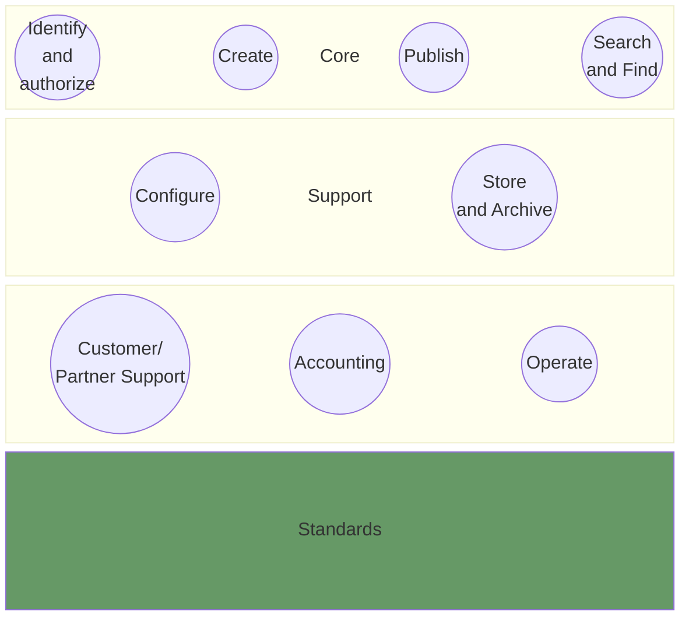
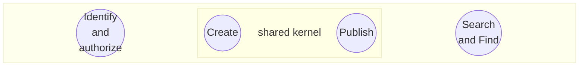
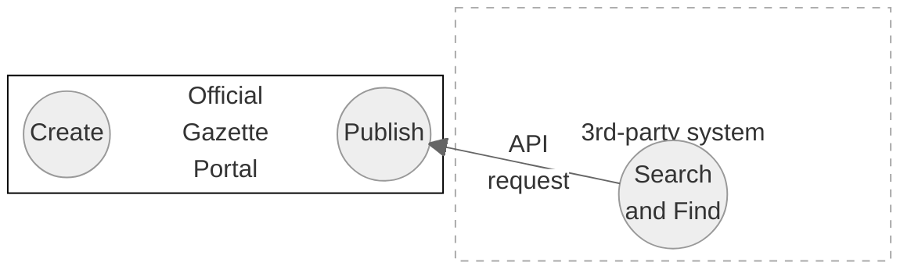

# Big Picture

## Purpose of this page
This Page provides an overview of all existing artifacts from different perspectives. The purose is to provide a better understanding how these existing (open source) artifacts play together. 
> [!NOTE]
> The following overview describes in particular the existing artifacts themselves, to the extent that they are relevant to the future solution. On the other hand, it also describes aspects of the future solution on a less technical level.

## domain driven design perspective
In the sense of a **strategic domain driven design** approach (DDD), the official gazette ecosystem consists of several domains, whereby the primary goal of the core domain is the publication of legally binding announcements.

The individual (sub)domains and their entities are described in the following sections. 

## The core domain

The most important functionality of the current and future system is the ability to create and publish an official publication. The publishing entity must be provided with the necessary tools to do this: A publication can be entered either manually using a form (GUI) or via API. As a consequence, "Create" and "Publish" can be considered as core functionalities. 

As these two are stongly linked, they can be considered using a "shared kernel" in the sense of DDD. The "Identify and authorise" domain is part of the core domain because it is essential for the publication to have the corresponding authorisations. As an IAM implementation is intended in the future system, user identification should technically no longer be part of the core system.
 "Search and Find" comprises all the functionalities required to find a publication and thus ultimately serves to fulfil the official mandate. It should be noted that a publication does not necessarily have to be initially found on the official gazette portal - it may well be that a publication is searched in a third-party system but is eventually displayed on the official gazette portal (s. fig. below).

## The support domain

## The generic domain

## Standards

## The form configuration

