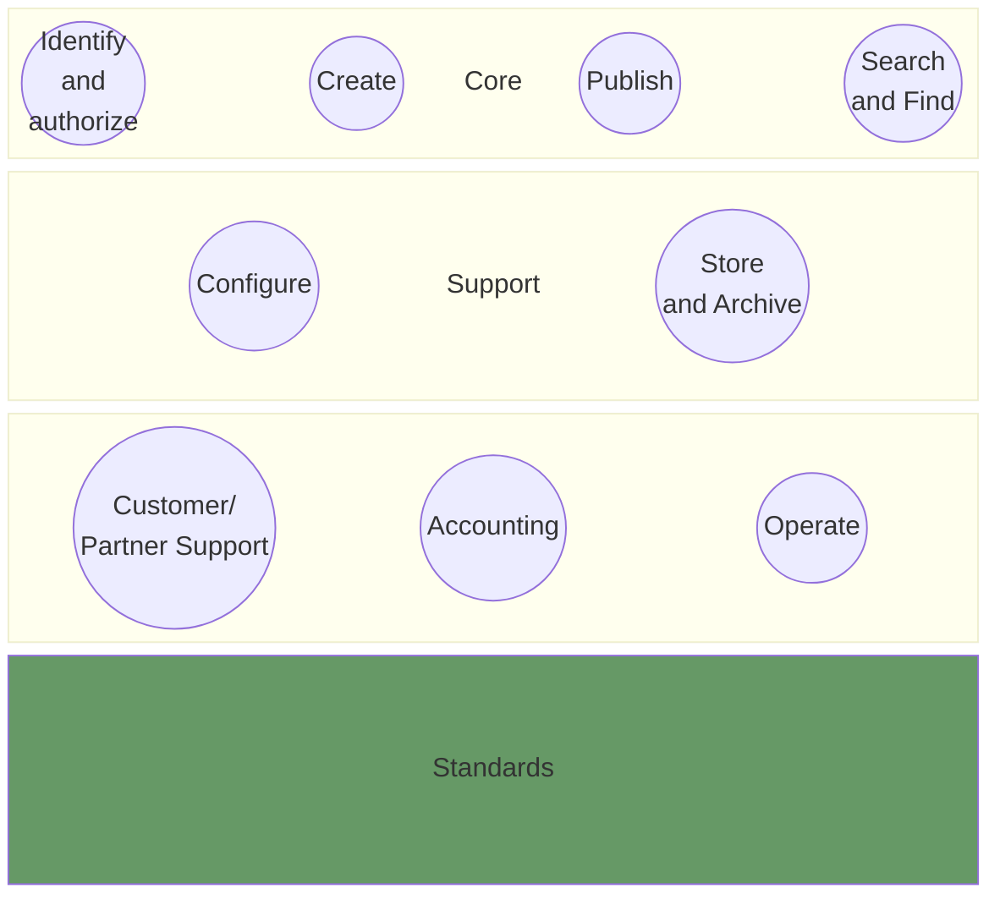
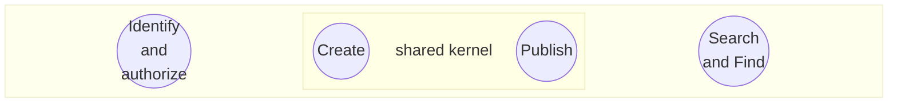
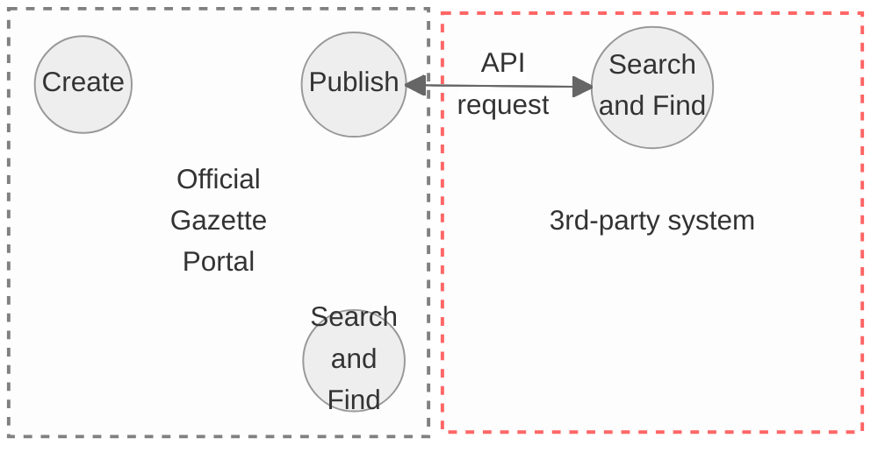

# Big Picture

## Purpose of this page
This Page provides an overview of all existing artifacts from different perspectives. The purose is to provide a better understanding how these existing (open source) artifacts play together. 
> [!NOTE]
> The following overview describes in particular the existing artifacts themselves, to the extent that they are relevant to the future solution. On the other hand, it also describes aspects of the future solution on a less technical level.
>
> Please note: The individual components can only be limited runned independently.

## A domain driven design perspective
In the sense of a **strategic domain driven design** approach (DDD), the official gazette ecosystem consists of several domains, whereby the primary goal of the core domain is the publication of legally binding announcements.

The individual (sub)domains and their entities are described in the following sections. 

### The core domain

The most important functionality of the current and future system is the ability to create and publish an official publication. The publishing entity must be provided with the necessary tools to do this: A publication can be entered either manually using a form (GUI) or via API. As a consequence, "Create" and "Publish" can be considered as core functionalities. 

As these two are stongly linked, they can be considered using a "shared kernel" in the sense of DDD. The "Identify and authorise" domain is part of the core domain because it is essential for the publication to have the corresponding authorisations. As an IAM implementation is intended in the future system, user identification should technically no longer be part of the core system.

"Search and Find" comprises all the functionalities required to find a publication and thus ultimately serves to fulfil the official mandate. It should be noted that a publication does not necessarily have to be initially found on the official gazette portal - it may well be that a publication is searched in a third-party system but is eventually displayed on the official gazette portal (s. fig. below, one or many publications can be found and displayed via REST API).

### The support domain

**Configure subdomain:** The configuration domain is closely linked to the standards. Ultimately, all configurations should be highly standardised in order to ensure the largest possible interoperability of the entire system.
[The source code for the publication configuration server can be found here](https://github.com/officialgazette/publication-configurator-server)

**Store and Archive:** Publications that have reached their expiration date should no longer be stored in the core system. These should either be trasferred to an archive of the tenant (e.g. cantonal or federal archive) or in a temporary file store. Nevertheless, certain publications still have to be found using the search function, depending on their access permissions.
[The source code for the current temporary file store (referred as "the archive") can be found here](https://github.com/officialgazette/publication-archive)

### The generic domain
The artifacts of the generic domain are not discussed in detail here, as neither open source components nor significant technical implementations are to be documented. One exception is the API for the SAP connection. Further information can be found under https://www.re-launch.ch/sap-integration.

### The Standard
The standard affects most of the domains described, it can be regarded as the glue between most of the subdomains described. In particular, the following aspects are covered
* A general scheme describes the basic structure of a publication
* The terms catalog describes all possible terms of a publication
* The publication type configuration describes the tenant-specific characteristics of a publication type

## Which artifacts are available in the present repositories?
Various open source artifacts are available in the present repositories. The following illustration shows how these are connected in functional and technical aspects. 

[Publication standard](https://github.com/officialgazette/publication-standard).
