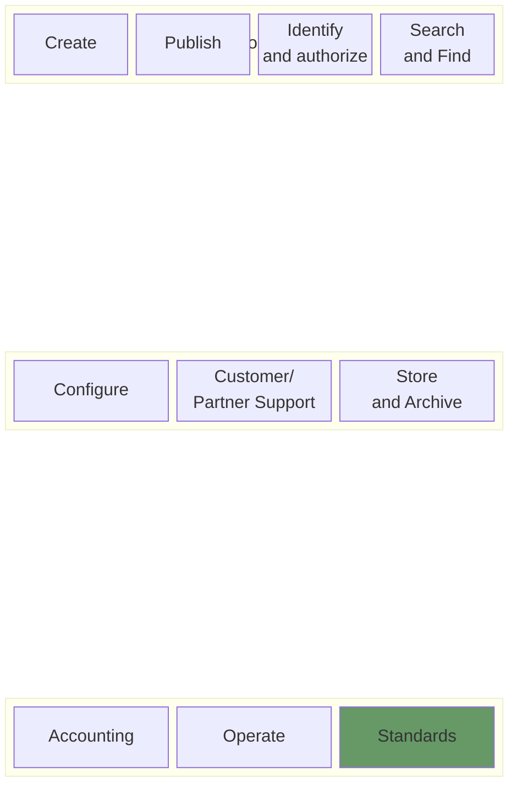

# Big Picture
This Page provides an overview of all available open source artifacts and how they play together. The official gazette. In the sense of the domain driven design approach, the official gazette ecosystem consists of several domains, whereby the core domain is the publication of legally binding announcements.

