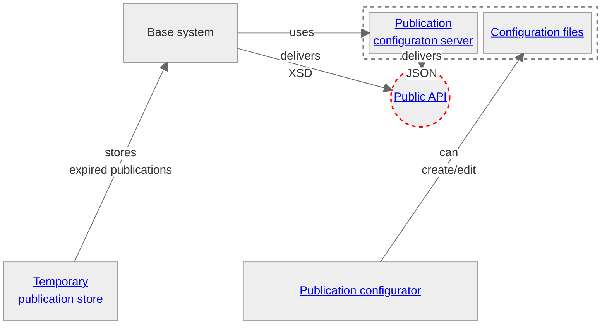

# Big Picture

## Purpose of this page
This Page provides an overview of all existing artifacts. The purpose is to give a better understanding on how these existing (open source) artifacts play together, in particular with regard to the establishment of a future standard for the exchange of publication data.

> [!IMPORTANT]
> As part of the public tender “Relaunch Amtsblattportal” the existing concepts and artifacts should be challenged and revised. These have grown over time and will certainly have to be redesigned as part of the project. In particular, a rough concept for a future standard must be submitted.
>
> For a better understanding of this task, it can be proceeded as follows:
> 1. Gain a rough understanding of the functional domains. The tender documents in particular should be consulted for this purpose.
> 2. Gain an understanding of the technical context of the existing artifacts. Information on this (in addition to the tender documents) can also be found in this repository.
> 3. Gain a deeper understanding of the existing elements, the current publication scheme and the terms catalog and how they play together. Tips on how to do this can be found in the respective repositories (see "Tips")
> 4. Submit optimization proposals or alternative approaches as part of the tender process. These should eventually result in the development of a future standard.

> [!NOTE]
> The following overview describes the existing artifacts themselves, to the extent that they may be relevant to the future solution and standardisation. The individual components cannot run autonomous in every case. The operator of the official gazette portal will not provide any assistance with the interpretation of the source code or its installation.
> 
> The following repositories are provided:
> 1. The publication configuration server, see [here](https://github.com/officialgazette/publication-configurator-server)
> 2. The publication configurator, see [here](https://github.com/officialgazette/publication-configurator)
> 3. The publication standard, see [here](https://github.com/officialgazette/publication-standard)
> 4. The temporary file store (also known as "the archive"), see [here](https://github.com/officialgazette/temp-publication-store)
>
> All other components of the existing solution are not available under an open source license or cannot be made available open source for other reasons. 

## Overview of the artifacts
Various open source artifacts are available in the present repositories. The following illustration shows how these are connected in functional and technical aspects. The links on the artifacts point to the respective repositories (if available).

${\color{red}----}$ **Note:** A description of the current API can be found at https://amtsblattportal.ch/docs/api. Information on the generic schema (referred as "Schema 2.0") can be found in the chapter [Publication Schema 2.0](https://amtsblattportal.ch/docs/api/#_publication_schema_2_0)

### What do these artifacts do?
1. **The base system:** The base system handles all matters (at runtime) relating to the publication of publications, including the creation of a publication via forms or API, the depiction of the publications and their sealing, all search and subscription functions, etc. Note: The sources of the base system can not be made available here. 
2. **The publication configuraton server:** The publication configuration server delivers the specific configurations per publication type. 
3. **The publication configurator:** The publication configurator is used for the basic configuration of the terms catalog and client-specific configurations using a GUI. This tool has no direct technical connection to the publication configuration server, the exchange of the configs takes place via JSON files (s. "configuration files" below).
4. **The configuration files:** The configuration files are primarily used as an exchange format between the publication configuration server and the publication configurator. There is a file for the terms catalog and a file for the tenant-specific publication type configuration. These configuration files are one of the main areas in which standardization is required.
5. **The temporary file store:** The temporary file store (often somewhat misleading referred to as "the archive") ensures the persistence of publications beyond their expiration date. Long-term, legally binding archiving of publications should, however, take place in a long-term archive of the respective responsible tenant.

## Why a standard?
The growing number of official publications in the official gazette portal shows that the introduction of a standard that applies to all possible types of publications is unavoidable. Today, official gazettes are already structured using a uniform publication type catalog with standardized publication elements. Based on a predefined catalog, the tenant can choose which publication types with which elements he wants to use for his official gazette.

The figure above shows that the federal characteristics are nevertheless taken into account (and will continue to be taken into account in the future): For example, a construction approval may be called “Building application” in one canton and “Building project” in another, even if the essence of the publication is the same.

A standardised exchange structure offers a number of advantages, such as:

- Enabling a seamless exchange of publication in general
- Ensuring that the publications remain readable and processable at a future time
- The import and export of publications is simplified and each publication type can be processed in the same way
- The schemes are easier to read once the basic principles have been understood
- The new publication structure should follow universal semantics that apply to all publication types. Wherever possible, the schema structure should be based on existing eCH standards.
- The standard should be stored as an eCH standard and thus have a binding character

All available resources regarding standardization can be found in [this repository](https://github.com/officialgazette/publication-standard).

