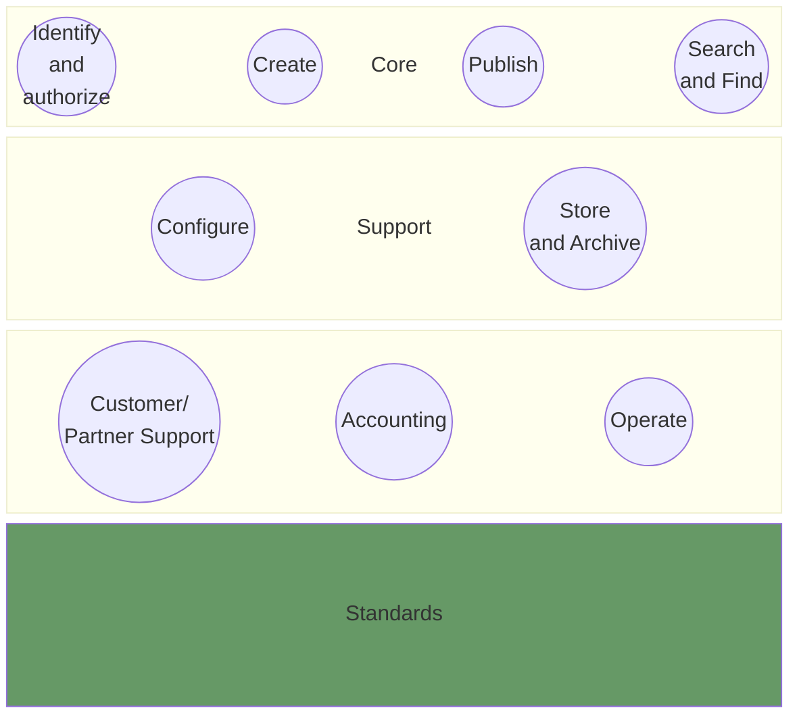
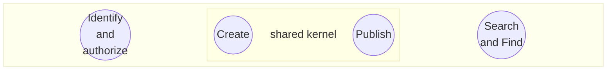
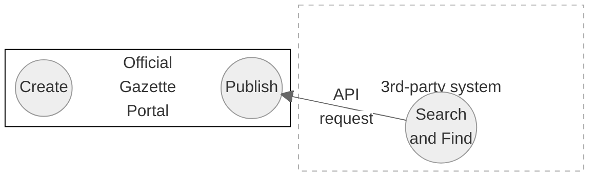
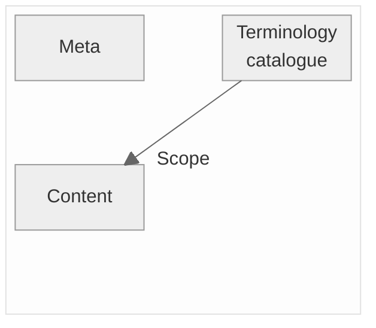

# Big Picture

## Purpose of this page
This Page provides an overview of all existing artifacts from different perspectives. The purose is to provide a better understanding how these existing (open source) artifacts play together. 
> [!NOTE]
> The following overview describes in particular the existing artifacts themselves, to the extent that they are relevant to the future solution. On the other hand, it also describes aspects of the future solution on a less technical level.

## domain driven design perspective
In the sense of a **strategic domain driven design** approach (DDD), the official gazette ecosystem consists of several domains, whereby the primary goal of the core domain is the publication of legally binding announcements.




The individual (sub)domains and their entities are described in the following sections. 

## The core domains

The most important functionality of the current and future system is the ability to create and publish an official publication. The publishing entity must be provided with the necessary tools to do this: A publication can be entered either manually using a form (GUI) or via API. As a consequence, "Create" and "Publish" can be considered as core functionalities. 


As these two are stongly linked, they can be considered using a "shared kernel" in the sense of DDD. The "Identify and authorise" domain is part of the core domain because it is essential for the publication to have the corresponding authorisations. As an IAM implementation is intended in the future system, user identification should technically no longer be part of the core system.
 "Search and Find" comprises all the functionalities required to find a publication and thus ultimately serves to fulfil the official mandate. It should be noted that a publication does not necessarily have to be initially found on the official gazette portal - it may well be that a publication is searched in a third-party system but is eventually displayed on the official gazette portal (s. fig. below).



## The support domains
### The configure domain
The configuration domain is closely linked to the standards. Ultimately, all configurations should be highly standardised in order to ensure the largest possible interoperability of the entire system.

## The generic domains

## Requirements for future standardisation

[Publication standard](https://github.com/officialgazette/publication-standard).
### Scope of the standardisation


### The meta data
> [!IMPORTANT]
> The structure and elements described below correspond to the existing exchange format for official publications. For reasons of downward compatibility, it may be a good approach to keep this structure in a future solution or standardisation.

### the content data

### The terminology catalogue
All terms used in a specific publication are stored in a neutral terminology catalogue. This can currently be accessed in JSON format at the following URL: https://amtsblattportal.ch/terms 
A term object ("term") contains various information and is structured as follows:
```
{
"key" : "constructionProject",
"type" : "businessCase",
"valueType" : "text",
"term" : {
  "de" : "Planning application",
  "fr" : "Demande d'autorisation de construire"
  }
}
```


### The content
### Semantic structuring

As in Version 1, the schema distinguishes between meta and content elements whereby the meta elements do not change in version 2.0.
The content element consists of four elements that give the message a semantically usable structure:

* controls

Contains the configuration controls as boolean values (e.g.: "apiImport" must be set "true" when importing a publication via API)

* location

Describes the assignment of the publication to a municipality. If a message cannot be assigned to a municipality, this element remains empty.

* action

Describes the nature of a publication

* businessCase

Describes the business case on which the publication is based.

* reaction

Describes the possible reactions to a publication

### The content structure

The following figure shows the  content structure of a publication:


image::publication_schema_overview.png[publication schema overview, 700px]

Each element has an element key and a term in German or French. 
The element is also typified by means of a "valueType" element. The following schema excerpt shows the possible elements.


**key:** Contains the key of the term. This uniquely identifies the term, even if the term is renamed on a client-specific basis (for example, a "building application" may be called a "building project", depending on the publication organ).

**type:** Describes the type of term from a technical perspective:
- action
- businessCase
- businessTerm
- enumValue
- reaction
- municipalityId

**valueType:** Describes the type of term from a technical/structural perspective:
- text
- textNeutral
- richtext
- int
- enum
- date
- dateFromTo
- datetime
- address
- legalPerson
- naturalPerson
- naturalPersonLight
- naturalLegalPerson
- deceasedPerson
- url
- attachment

These types are mapped in the XML schema, further information on the structure can be found in the API doc at https://amtsblattportal.ch/docs/api.

## The configuration of Publishing types

