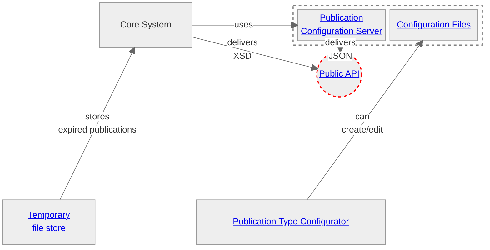

# Big Picture

## Purpose of this page
This Page provides an overview of all existing artifacts from different perspectives. The purose is to provide a better understanding how these existing (open source) artifacts play together. 
> [!IMPORTANT]
> As part of the public tender “Relaunch Amtsblattportal” the existing concepts and artifacts should be challenged and revised. These have grown over time and will certainly have to be redesigned as part of the project.

> [!NOTE]
> The following overview describes in particular the existing artifacts themselves, to the extent that they may be relevant to the future solution. The individual components can only be limited runned independently. The operator of the official gazette portal cannot provide any assistance with the interpretation of the source code or its installation.
> The following repositories are provided
> 1. The publication configuration server
> 2. The publication configurator configurator
> 3. The publication standard
> 4. The temporary file store (known as "the archive")

## How the arifacts play together
Various open source artifacts are available in the present repositories. The following illustration shows how these are connected in functional and technical aspects. The links on the artifacts point to the respective repositories (if available).

${\color{red}----}$ **Note:** A description of the current API can be found at https://amtsblattportal.ch/docs/api. Information on the generic schema (referred as "Schema 2.0") can be found in the chapter [Publication Schema 2.0](https://amtsblattportal.ch/docs/api/#_publication_schema_2_0)

### The Standard
The "standard" may not actually be classified as a domain. However, it affects most of the domains described above and is therefore treated as a separate topic here. In particular, the following artifacts are covered
* A general scheme describes the basic structure of a publication
* The terms catalog describes all possible terms of a publication
* The publication type configuration describes the tenant-specific characteristics of a publication type.

All available resources regarding standardization can be found in [this repository](https://github.com/officialgazette/publication-standard).

